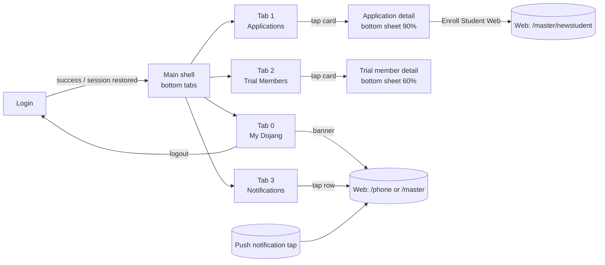

# Taekworld Master — Mobile App UI/UX Specification

Prepared 2026-09-11 for the mobile rewrite vendor. Derived from the shipped Flutter app (`App/Android`, `App/Apple`, version 1.2.1+5), so every screen, string and colour below is what the product does today.

There is **no Figma file** for this app. The original vendor built it straight in Flutter. This document plus the store screenshots in `screenshots/` are the design reference; a designer can recreate every screen from it, and the new vendor is free to restyle as long as the screen set, flows and copy are preserved unless we say otherwise (see §9 "What to change").

Companion: `02-API-INTEGRATION.md` and `taekworld-master-app.postman_collection.json` describe every backend call.

---

## 1. Product summary

- **Audience:** taekwondo school masters (owners/instructors). One account = one dojang.
- **Purpose:** be notified instantly about new student applications, trial members, enrollments and parent referrals, look up the details, and jump to the web platform to act. It is a *notification + lookup* companion; all editing happens on the web (`https://www.blackbelthw.com`, formerly `taekworld.com`).
- **Platforms:** Android (`com.taekworld.master`) and iOS (`com.taekworld.master`, display name "Taekworld Master").
- **Store copy:** `App/Note/App Explain` (English store listing draft).
- **Assets:** `screenshots/Logo.png`, `screenshots/app_icon_aja.png` (2134×2134 icon), `App/Logo/Logo.eps` (vector).

## 2. Screen map

Eight screens in total: Login, Main shell, My Dojang, Applications, Application detail sheet, Trial Members, Trial member detail sheet, Notifications history. Plus a debug screen that is hidden in release builds and a global crash screen.

**A push notification never deep-links to an in-app screen.** Tapping one opens the web platform in the external browser. Keep this behaviour unless the product decides otherwise (see §9).

## 3. App shell

### 3.1 Theme and tokens

| Token | Value | Used for |
|---|---|---|
| Brand red `kRed` | **#B00000** | App bars, primary button, detail-sheet header, pending avatar |
| Brand navy `kBlue` | **#001A57** | Section headings, login title, website banner gradient, "Enroll" button, "Total" stat |
| Accent orange | #FF9800 (Material orange) | 7-day trial, "new" pills |
| Accent green | #4CAF50 | 30-day trial, new students |
| Accent blue | #2196F3 / #1976D2 | current students, links, unread |
| Accent purple | #9C27B0 | recommendations |
| Accent yellow | #FFEB3B | "NEW" application highlight |
| Greys | Material grey 50–700 | backgrounds (#FAFAFA page, white cards), text (#757575 secondary, #616161 labels) |

- Material 3, **light theme only**, no dark mode.
- **Typography:** platform default (Roboto / San Francisco). Sizes in use: 32 (titles, stat values), 24, 20, 18 (section headers), 16 (body strong), 14 (body), 12 (meta), 10–11 (badges).
- Edge-to-edge with transparent status/navigation bars.

### 3.2 Navigation

Bottom navigation bar, fixed, four tabs. All four pages stay mounted (state survives tab switches).

| # | Icon | Label | Screen | Badge |
|---|---|---|---|---|
| 0 | home | **My Dojang** (Android currently says "Home"; use "My Dojang") | Dashboard | none |
| 1 | school / assignment | **Applications** | Applications list | red, unviewed pending count |
| 2 | people / groups | **Trial Members** | Trial members list | blue, new trial count |
| 3 | notifications | **Notifications** | History | red, unread count |

Badge: circle, min 18×18, white 10sp bold, `99+` cap, offset to the top-right of the icon. Selected tab colour: brand red; unselected: grey. Opening the Notifications tab marks everything read and clears its badge.

App bar: brand red background, white title and icons, no back arrow on tab roots. (Today two screens forget to set white foreground and one has no colour at all; standardise.)

## 4. Screens

### 4.1 Login

Reference: `screenshots/phone-1.png`, `tablet10-1.jpg`.

Two states:

**A. Checking session** (every cold start, while stored credentials are read): page background #FAFAFA, centred spinner in brand navy, 24 px, text "Checking session..." 16sp grey. If a token + user + dojang id are stored the app goes straight to the shell.

**B. Form** — centred, max width 400, padding 24:
1. App icon 80×80 (`app_icon_aja.png`).
2. "**Taekworld Master**" 32sp bold navy.
3. "Master Login Portal" 16sp grey.
4. Card (radius 12, 1 px #EEEEEE border, padding 24):
   - Field "Email Address" with mail icon, email keyboard.
   - Field "Password" with lock icon and show/hide eye toggle, obscured by default.
   - Inline error box (bg #FFEBEE, border #EF9A9A, text #D32F2F 14sp) when login fails.
   - Button "**Login**" full width, brand red, 18sp bold white, radius 8; shows a 20 px white spinner while busy.
5. "© 2024 Taekworld. All rights reserved." 14sp grey.

Behaviour: `POST /api/Auth/login` (see API doc). Success → replace with Main shell. Failure → error text in the box (server message or one of the fallback strings in §7).

Today there is **no client-side validation** (empty fields go to the server) and no "forgot password", sign-up, remember-me or biometrics. Add required-field and email-format validation; forgot-password can link to the web.

### 4.2 Main shell

- While the stored user loads: centred spinner (add the logo and a "Loading…" label).
- On mount: starts the background notification service (Android), opens any pending URL saved by a notification tap while the app was closed, and re-checks notifications on resume.
- Notification tap handler → opens `https://www.blackbelthw.com/{masterPhone}` (or `/master`) in the external browser. On failure: snackbar "Could not open browser" with action "Copy Link".

### 4.3 My Dojang (tab 0)

Reference: `screenshots/phone-2.png`, `tablet10-2.jpg`, `tablet10-3.jpg`.

App bar "My Dojang" with a logout icon on the right (no confirmation today; add one).

Body, vertical scroll, pull-to-refresh, silent refresh on app resume:

1. **Dojang Information** card (elevation 2, padding 12): heading 18sp bold navy; six label/value rows with a 100 px label column: Name, ID, Master, Email, Phone, Status. Missing values show "N/A"; status falls back to "Unknown".
2. **Website banner** (tappable, radius 12, gradient navy → #1976D2, soft blue shadow): launch icon, "View Detailed Information" 14sp bold white, "Click here to check detailed data on the website" 12sp white 90 %, chevron. Tap → external browser `https://www.blackbelthw.com/{phone}`.
3. **Member Statistics** heading 18sp bold navy, then stat cards (2 per row, 12 px gutter; last one full width). Each card: white, elevation 2, 4 px left accent border, title 14sp grey, value 32sp bold in the accent colour.

| Card | Accent | Source field |
|---|---|---|
| Current Students | blue | `currentStudents` (app subtracts 1 for the master's own record; keep or fix server-side) |
| 7 Days Trial | orange | `sevenDaysTrial` |
| 30 Days Trial | red | `thirtyDaysTrial` |
| New Students | green | `newStudents` |
| Recommendations | purple | `recommendationCount` |

Loading: full-screen spinner only on first load. Error: none today (spinner just stops). Add an error state with retry.

### 4.4 Applications (tab 1)

App bar "Student Applications", brand red, white; when there are unviewed items an orange pill "{n} new" next to the title; refresh icon on the right.

Timing: loads 0.5 s after mount, silent auto-refresh every 10 s, pull-to-refresh. No pagination (full list).

Body (padding 16):
1. Section header **Pending Applications** — 20sp bold navy, 2 px navy underline; red pill "{n} new" when unviewed > 0; count chip on the right ("{unviewed}/{total}", orange when unviewed > 0 else grey).
2. Cards, or empty card "No pending applications".
3. Section header **Application History** — 18sp bold grey, 1 px grey underline, grey count chip.
4. Cards (viewed style), or "No application history".

**Application card:** card with a 4 px left border (yellow when new), circle avatar with the student's initial (yellow when new, brand red when pending, grey in history), student name 16sp bold (+ yellow "NEW" pill when new), "Parent: {name}" 14sp grey, "Applied: M/D/YYYY" 12sp grey, chevron. History rows add a green check + "Viewed on M/D/YYYY". Tap → marks viewed, loads detail, opens the sheet.

### 4.5 Application detail (bottom sheet, 90 % height)

Header: brand red, top radius 20, "Student Application" 20sp bold white, student name below in white 70 %, close (×) on the right.

Sections (title 18sp bold navy; card with 1 px #E0E0E0 border; rows with a 120 px label column, "N/A" when empty):

| Section | Rows |
|---|---|
| Student Information | First Name, Last Name, Date of Birth, Gender, School/Grade |
| Parent/Guardian Information | Name, Relationship, Phone, Email, Address (street, city, state zip) |
| Emergency Contact | Name, Phone |
| Medical Information (only when the applicant reported conditions) | Allergies, Medical Conditions, Current Medications (each only if present) |
| Application Details | Application Date, Status, Viewed Date (if any) |

Floating primary button pinned to the bottom (16 px insets, radius 12):
- Not enrolled: navy, browser icon, "**Enroll Student (Web)**" → opens `https://www.blackbelthw.com/master/newstudent` in the external browser (no student id in the URL by design: PII must not travel in a URL until an opaque hand-off token exists on the API). Snackbar "Enrollment page opened. Refreshing application status", sheet closes after 1 s, list refreshes when the app comes back.
- Enrolled: grey, check icon, "Already Enrolled", disabled.

Fallback dialog when the browser cannot be opened: title "Unable to Open Browser", body "Could not open the enrollment page in your browser." / "Please copy this URL and open it manually:" + selectable URL, actions "Copy URL" and "Close".

### 4.6 Trial Members (tab 2)

App bar "Trial Members", brand red; orange pill "{n} NEW" when new members exist; refresh icon.

Timing: loads 0.5 s after mount, silent auto-refresh every 30 s, pull-to-refresh.

Body (padding 16):
1. **New Trial Members** stats card: title 20sp bold navy; three stat items side by side (value 32sp bold, label 14sp grey): "7-Day" orange, "30-Day" green, "Total" navy.
2. Section header **7-Day Trial Members** (orange, 2 px underline, count chip), cards or "No new 7-day trial members".
3. Section header **30-Day Trial Members** (green), cards or "No new 30-day trial members".

**Trial member card:** circle avatar tinted orange (7-day) or green (30-day) with the initial ("?" if no name); name 16sp bold; email and phone 12sp grey; right column: pill "{7|30} days" in the trial colour and "{n} days left" 11sp grey or "Expired" in red.

**Trial member detail (bottom sheet, 60 % height):** drag handle, name 24sp bold, pill "{7|30}-Day Trial", rows (120 px labels): Email, Phone, User Code, Registration Date, Trial Ends, Days Remaining, New Student (Yes/No). Read-only, no actions.

Today a manual refresh blanks the whole list behind a spinner; make refreshes non-blocking like the Applications tab.

### 4.7 Notifications (tab 3)

App bar "Notifications" (give it the brand colour; today it has none). Overflow menu (only when the list is non-empty): "Mark all as read", "Clear history" (red) → confirm dialog "Clear History" / "Are you sure you want to clear all notification history?" with "Cancel" and "Clear".

Empty state: bell-off icon 64 px grey, "No notifications yet" 18sp, "Notifications will appear here when you receive them" 14sp.

List (local history, newest first, capped at 100 stored): card per item, light-blue background when unread; leading circle icon by type — application → person-add, trial → people, registration → how-to-reg, invitation → mail, other → bell; title (bold when unread), message, relative time ("Just now", "5m ago", "3h ago", "Yesterday", "4d ago", then a date); blue dot when unread. Swipe left shows a red delete background. Tap → mark read and open the web platform in the browser.

Today the swipe only marks the item read (it reappears). Implement a real delete or drop the swipe affordance.

### 4.8 Global crash screen

White page, red error icon 48 px, "Something went wrong" 18sp bold, "Please restart the app" grey. Add a retry/reload button.

### 4.9 Debug screen (hidden)

`Service Debug` (service status, start/stop, force check, clear cache, app state, device info, troubleshooting tips). Reachable only when a compile-time debug flag is on. Not part of the product; the vendor can keep an equivalent behind a hidden gesture or drop it.

## 5. Notifications UX

- **Content is server-supplied** (title, message, type); the app has no templates. Types seen: `application`, `trial`, `registration`, `invitation`.
- **Android today:** no FCM. A persistent foreground service ("Taekworld Master — Monitoring for notifications…", updated to "Active - Last check: H:MM") polls the API every 10 s and raises local heads-up notifications on channel "Taekworld Alerts" with a custom sound (`assets/sounds/notification.mp3` played by the app), vibration, red LED, big-text style with summary "Tap to open Taekworld". This is the main thing to replace: **use FCM on both platforms** (the API already has device registration and FCM sending; see API doc).
- **iOS today:** APNs via FCM, sound `notification.caf`, subtitle "Taekworld Master", time-sensitive interruption level, app icon badge = unread count.
- **Tap:** opens the web platform in the browser (`/{phone}` or `/master`); if the app was killed the URL is stored and opened after launch.
- **Permission prompt:** the iOS build shows a soft-ask after login — title "Enable Notifications?", body "Get notified about important updates and new messages. You can change this later in Settings." + "Note: Notifications are optional and the app works without them.", actions "Not Now" / "Enable". Android has none. Use the soft-ask on both.
- Every delivered push is mirrored into the local history list (tab 3).

## 6. Reusable components

- **InfoRow** — label (100 px, w600 grey) : value (wraps). Used in the dojang card.
- **StatCard** — white card, 4 px left accent, 14sp grey title, 32sp bold accent value.
- **Section header** — title + coloured underline + count chip (three private copies exist today; make one component).
- **Detail row** — 120 px label column, "N/A" fallback (sheets).
- **Count pill / NEW pill** — radius 10–12, 10–12sp bold.
- **Bottom sheet** — white, top radius 20, optional drag handle; 90 % (application) or 60 % (trial member).

## 7. Copy (verbatim, English only; there is no localisation layer today)

Login: "Checking session...", "Taekworld Master", "Master Login Portal", "Email Address", "Password", "Login", "© 2024 Taekworld. All rights reserved." Error fallbacks: "No internet connection. Please check your network settings.", "Unable to connect to the server. Please check your internet connection and try again.", "That email or password doesn't seem to match. Please check and try again!", "Too many login attempts. Please wait a moment and try again.", "The server is temporarily unavailable. Please try again in a few moments.", "Login failed. Please try again."

My Dojang: "My Dojang", "Dojang Information", "Name", "ID", "Master", "Email", "Phone", "Status", "N/A", "View Detailed Information", "Click here to check detailed data on the website", "Member Statistics", "Current Students", "7 Days Trial", "30 Days Trial", "New Students", "Recommendations", "Could not open website".

Shell: "My Dojang", "Applications", "Trial Members", "Notifications", "99+", "Could not open browser", "Copy Link".

Applications: "Student Applications", "{n} new", "Pending Applications", "Application History", "No pending applications", "No application history", "NEW", "Parent: {name}", "Applied: {date}", "Viewed on {date}", "Application status refresh requested".

Application detail: "Student Application", "Student Information", "First Name", "Last Name", "Date of Birth", "Gender", "School/Grade", "Parent/Guardian Information", "Name", "Relationship", "Phone", "Email", "Address", "Emergency Contact", "Medical Information", "Allergies", "Medical Conditions", "Current Medications", "Application Details", "Application Date", "Status", "Viewed Date", "Enroll Student (Web)", "Already Enrolled", "Student is already enrolled", "Enrollment page opened. Refreshing application status", "Unable to Open Browser", "Could not open the enrollment page in your browser.", "Please copy this URL and open it manually:", "Copy URL", "Close", "URL copied to clipboard".

Trial Members: "Trial Members", "{n} NEW", "New Trial Members", "7-Day", "30-Day", "Total", "7-Day Trial Members", "30-Day Trial Members", "No new 7-day trial members", "No new 30-day trial members", "{n}-Day Trial", "{n} days", "{n} days left", "Expired", "Email", "Phone", "User Code", "Registration Date", "Trial Ends", "Days Remaining", "New Student", "Yes", "No".

Notifications: "Notifications", "Mark all as read", "Clear history", "Clear History", "Are you sure you want to clear all notification history?", "Cancel", "Clear", "All notifications marked as read", "Notification history cleared", "No notifications yet", "Notifications will appear here when you receive them", "Just now", "{n}m ago", "{n}h ago", "Yesterday", "{n}d ago".

System notifications: "Taekworld Master", "Monitoring for notifications...", "Active - Last check: {time}", "Taekworld Alerts", "Tap to open Taekworld". Permission dialog: "Enable Notifications?", "Not Now", "Enable". Crash: "Something went wrong", "Please restart the app".

## 8. Web hand-off URLs

All opened with the OS browser (external application mode). The app currently uses the old host `taekworld.com`, which still serves the same site; the new build must use **`https://www.blackbelthw.com`**, the primary domain. `/master` and `/master/newstudent` require a master web login and bounce to the home page when the browser has no session, which is the expected behaviour.

| Trigger | URL |
|---|---|
| Dojang banner, notification tap, notification-history row | `https://www.blackbelthw.com/{masterPhone10digits}` |
| Same when the phone is unknown | `https://www.blackbelthw.com/master` |
| Enroll Student (Web) | `https://www.blackbelthw.com/master/newstudent` |

## 9. What to change in the rewrite (product decisions already taken)

1. FCM on both platforms; drop the Android polling foreground service.
2. Use `https://www.blackbelthw.com` for every web link.
3. Add login validation, logout confirmation, error states with retry on every data screen, non-blocking refresh, real delete in notification history.
4. Store the token in secure storage (today it is plain SharedPreferences).
5. Soft-ask notification permission dialog on both platforms.
6. Consistent app bar (brand red, white foreground) and tab labels (My Dojang / Applications / Trial Members / Notifications).
7. Everything else (screen set, information architecture, copy, colours) may be restyled but should stay functionally identical.

## 10. Known dead ends in the current code (do not spec from them)

- `README.md` in both forks describes a "RAG chatbot" app that never existed.
- `ApiService.enrollStudent()` and several notification endpoints are implemented but never called from the UI.
- The Service Debug screen is unreachable in release builds.
- `assets/.env` is loaded but not bundled.
